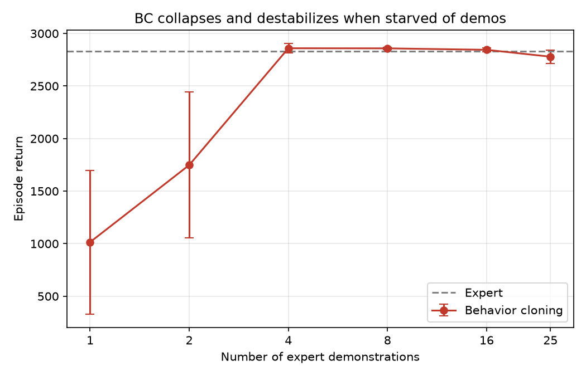
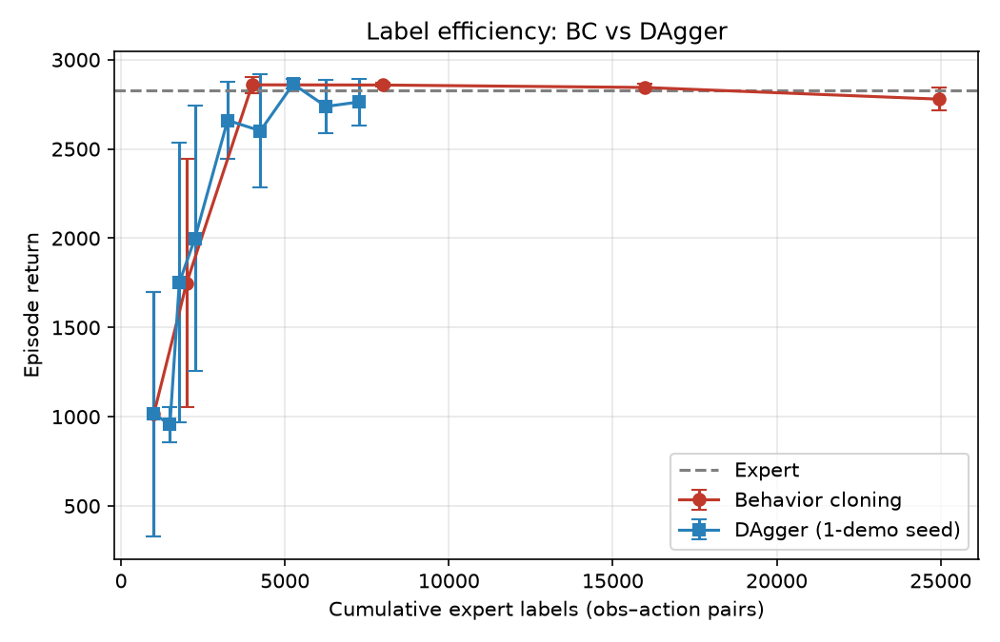

# Behavior Cloning vs. DAgger

A from-scratch empirical study of distribution shift in imitation learning: behavior cloning vs. DAgger on Hopper-v5.

## TL;DR





Behavior cloning trained on a near-optimal expert collapses and becomes unstable when given few demonstrations (Figure 1). This is distribution shift: the cloned policy drifts into states the expert never visited, has no labels there, and compounds error until it falls. DAgger fixes this by letting the student drive and asking the expert to label the states the student actually visits. Starting from a single collapsed demonstration, DAgger recovers stable, expert-level return (Figure 2).

On this task BC and DAgger end up roughly label-equivalent, because each Hopper demonstration is about 1000 dense, low-noise steps, which makes BC an unusually strong baseline. DAgger's distinctive value here is recovering from a starved seed that BC alone cannot escape.

## What this is, and what it is not

This is a small, controlled study built to demonstrate one phenomenon (distribution shift / compounding error) empirically rather than just describe it. It is not original research and not a polished tutorial. Everything runs locally on a MacBook (Apple Silicon, CPU only): no CUDA, no Isaac, no large models.

The expert, the network, and the training loop are held fixed across every experiment. The only thing that changes is where the training data comes from. That isolation is the point: when BC fails and DAgger succeeds with the identical network, the difference is provably about the data distribution, not the model.

## Setup

- **Environment:** Hopper-v5 (Gymnasium, official MuJoCo bindings). Chosen because early termination makes compounding error visible: a drifted policy falls, the episode ends, and return collapses to near zero.
- **Expert:** a PPO policy (Stable-Baselines3), trained to 2704 ± 337 return. Kept as a queryable policy object, not a frozen dataset, because DAgger needs to ask the expert what to do at brand-new states the learner wanders into.
- **Learner:** a small MLP (two hidden layers of 256), trained by MSE regression on (observation, action) pairs. The same network is used for BC and DAgger.
- **Stack:** gymnasium[mujoco], stable-baselines3, torch (CPU), numpy, matplotlib.

## Results

### Figure 1: BC collapses when starved of demonstrations

Train the identical BC setup on the first N demonstrations for N in {1, 2, 4, 8, 16, 25}, averaged over 3 training seeds, and evaluate each. Only the number of demos changes, so the curve isolates one variable: state-space coverage.

| Demos | Pairs | Return |
|------:|------:|:-------|
| 1 | 1000 | 1015 ± 684 |
| 2 | 2000 | 1748 ± 694 |
| 4 | 4000 | 2859 ± 44 |
| 8 | 7983 | 2858 ± 10 |
| 16 | 15983 | 2845 ± 20 |
| 25 | 24960 | 2779 ± 64 |

At 1 and 2 demos the policy is both collapsed and highly unstable. The large error bars are the signature of compounding error: the policy is one drift away from falling, and whether it survives depends on the seed. By 4 demos the state coverage is wide enough that BC reaches expert level and the variance nearly vanishes.

Note that "1 demo" is already about 1000 training pairs, so the failure is not from too little data in raw count. It is from all those pairs lying along a single narrow path, which leaves the policy with no idea what to do once it drifts off that path.

### Figure 2: DAgger recovers from a collapsed seed

Seed DAgger with the same single collapsed demonstration (1015 ± 684) and run the loop: train on the current data, roll the student out, ask the expert to label every state the student visited, aggregate, retrain. Averaged over 3 independent runs, matching the BC methodology.

| Iter | Cumulative labels | Return |
|-----:|------------------:|:-------|
| 0 | 1000 | 1015 ± 684 |
| 2 | ~1778 | 1751 ± 783 |
| 4 | ~3252 | 2661 ± 215 |
| 6 | ~5252 | 2864 ± 27 |
| 8 | ~7252 | 2763 ± 131 |

DAgger climbs from the collapsed seed up to expert level, and the variance shrinks as it climbs (684 down to 27). That shrinking error bar is the robustness result: DAgger does not just raise the mean, it turns an unstable policy into a stable one.

On raw label count, BC and DAgger are about even: both reach the expert line near 4000 to 5000 labels. **DAgger does not beat BC on label efficiency on this task.** What it does is reach the same place starting from a collapsed 1-demo seed that BC, lacking any way to collect new states, cannot improve from at all.

## Why BC fails and DAgger helps

Picture the expert's behavior as a thin path winding through state space. BC only sees points on that path, so it has no labels anywhere off it. When the cloned policy runs, a small action error nudges it slightly off the path, into a state it has no data for. Its next action there is a guess, which pushes it further off, and the error compounds until it falls.

The core mismatch: BC is trained on the expert's states but tested on its own states. Those two distributions do not match. That is distribution shift.

DAgger closes the mismatch directly. It lets the student drive, which surfaces exactly the off-path states that trip it up, then asks the expert to label those states. The expert can answer, because it is competent everywhere, it was just never recorded there. So the student finally gets labels where it actually needs them. Over a few iterations the student's states and the labeled states converge.

In one line: **BC labels the expert's path; DAgger labels the student's path.**

## Honest caveats

- **Hopper makes BC strong.** Each demonstration is about 1000 dense, clean steps, so a handful of demos covers the expert's path well and BC saturates quickly (by 4 demos). On tasks with shorter or noisier demonstrations, BC would need many more demos and DAgger's advantage would be larger. The roughly-tied label efficiency here is a property of this task, not a general claim.
- **DAgger assumes a cheap, online expert.** Querying the expert at arbitrary states is free here because the expert is a saved policy. On real hardware the expert is often a human teleoperator, so DAgger means a person has to label the robot's drifted states live, which is slow and sometimes unsafe. This is why many real-robot systems lean on large behavior-cloning datasets instead of interactive correction. The label scarcity this project explores is the normal regime on real robots, where every demonstration costs human time.

## Repo structure

```
bc-vs-dagger/
├── README.md
├── requirements.txt
├── src/
│   ├── experts.py        # train PPO expert; load + query interface
│   ├── data.py           # rollout collection, demo dataset, dagger buffer
│   ├── policy.py         # the imitation MLP (shared by BC and DAgger)
│   ├── bc.py             # behavior cloning train loop
│   └── dagger.py         # DAgger loop (student drives, expert labels, aggregate)
├── scripts/
│   ├── 01_train_expert.py
│   ├── 02_collect_demos.py
│   ├── 03_train_bc.py
│   ├── 04_bc_data_ablation.py   # the failure: sweep #demos -> return collapse
│   ├── 05_train_dagger.py       # the fix: recover from a 1-demo seed
│   └── 06_make_plots.py
├── experts/              # saved expert (.zip + obs stats)
├── data/                 # demos.npz
└── results/              # metrics (.npz) + figures (.png)
```

## How to run

```bash
pip install -r requirements.txt

python scripts/01_train_expert.py        # ~15-25 min: train PPO expert
python scripts/02_collect_demos.py       # seconds: roll expert out, save demos
python scripts/03_train_bc.py            # seconds: BC on full data
python scripts/04_bc_data_ablation.py    # few min: the collapse curve
python scripts/05_train_dagger.py        # ~6-12 min: DAgger, 3 runs averaged
python scripts/06_make_plots.py          # seconds: write both figures
```

## Stack and install notes (Apple Silicon)

- Python 3.11 or 3.12.
- Use the official MuJoCo bindings via `gymnasium[mujoco]`. Do not use `mujoco-py`, which needs a compiler and is broken on Apple Silicon. The official bindings ship prebuilt arm64 wheels.
- Everything runs on CPU. For models this small, CPU is as fast as MPS and avoids op-support quirks. Stable-Baselines3 itself recommends CPU for MLP-policy PPO.